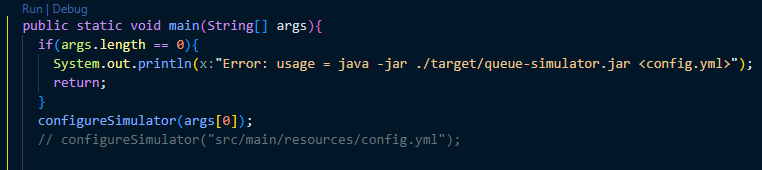

## Requirements and versions:
- Java (21)
- Maven (3.8.6)
## Compile the simulator

To compile the project and generate a JAR file, execute the command:

```bash
mvn clean package
```

This will generate a JAR file (`queue-simulator.jar`) in the `./target` directory.


## Execute the simulator

To run the simulator, execute the command:

```bash
java -jar ./target/queue-simulator.jar <config.yml>
```

Replace `<config.yml>` with the path to the YML configuration file.
  ```bash
  java -jar ./target/queue-simulator.jar ./src/main/resources/config.yml
  ```

OBS: if the commands don't work, it's possible to run the simulation manually in the `main` method of the `Simulator.java` file. It will be necessary to remove the `if` statement and the `configureSimulator(args[0])` call, then uncomment the `configureSimulator(<path>)` line. After that, press the `run` button.



## Example Configuration File

```yml
#--------------------------------------------
#
# - To make an infinite queue, remove its 'capacity' # field 
# - If 'randomValues' field is informed,  
# 'randomCount' will be ignored
#
#
#
#
#--------------------------------------------
arrivals: 
   Q1: 2.0

queues: 
   Q1: 
      servers: 1
      arrivalMin: 2.0
      arrivalMax: 4.0
      exitMin: 1.0
      exitMax: 2.0
   Q2: 
      servers: 2
      capacity: 5
      exitMin: 4.0
      exitMax: 8.0
   Q3: 
      servers: 2
      capacity: 10
      exitMin: 5.0
      exitMax: 15.0

network: 
- origin: Q1
  destination: Q2
  probability: 0.8
- origin: Q1
  destination: Q3
  probability: 0.2
- origin: Q2
  destination: Q1
  probability: 0.3
- origin: Q2
  destination: Q2
  probability: 0.5
- origin: Q3
  destination: Q3
  probability: 0.7

randomCount: 100000

# randomValues: 
# - 0.3
# - 0.4
# - 0.1
# - 0.9


```

